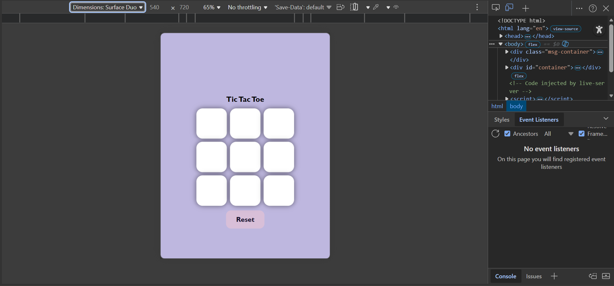
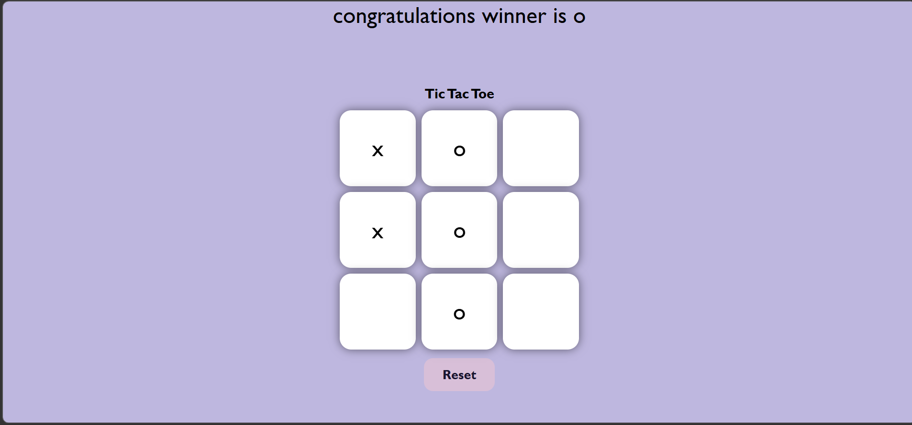
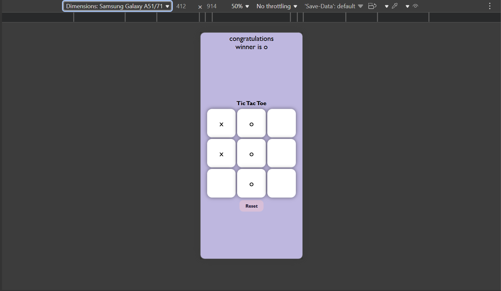

# 🎮 Tic Tac Toe Game

A fully responsive Tic Tac Toe game built using HTML, CSS, and JavaScript. This project features interactive gameplay for two players, real-time winner detection, draw handling, and a clean user interface.

## 📸 Preview
🟢 Game Start

🏆 Winner Screen

📱 Responsive View

## Live Demo
https://simple-tic-tac-toe-game-nu.vercel.app/
## 🚀 Features

* Two-player gameplay (X vs O)
* Winner detection logic
* Draw detection
* Reset game functionality
* Responsive design for mobile and desktop
* Smooth UI interactions

## 🛠️ Technologies Used

* HTML5
* CSS3 (Flexbox, Responsive Design)
* JavaScript (DOM Manipulation, Event Handling)

## ▶️ How to Run

1. Clone or download the repository
2. Open `index.html` in your browser

## 📱 Responsiveness

The game layout adapts to different screen sizes using responsive design techniques.

## 💡 Future Improvements

* Add AI opponent (Play vs Computer)
* Add scoreboard
* Add animations

## 👨‍💻 Author

Sai mali
